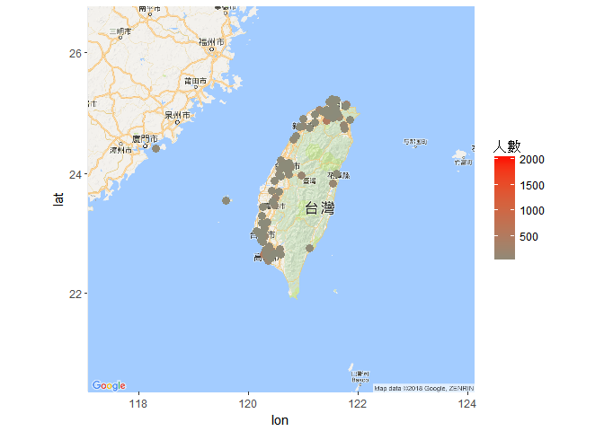

106-2 大數據分析方法 作業二
================
何品儀

作業完整說明[連結](https://docs.google.com/document/d/1aLGSsGXhgOVgwzSg9JdaNz2qGPQJSoupDAQownkGf_I/edit?usp=sharing)

學習再也不限定在自己出生的國家，台灣每年有許多學生選擇就讀國外的大專院校，同時也有人多國外的學生來台灣就讀，透過分析[大專校院境外學生人數統計](https://data.gov.tw/dataset/6289)、[大專校院本國學生出國進修交流數](https://data.gov.tw/dataset/24730)、[世界各主要國家之我國留學生人數統計表](https://ws.moe.edu.tw/Download.ashx?u=C099358C81D4876CC7586B178A6BD6D5062C39FB76BDE7EC7685C1A3C0846BCDD2B4F4C2FE907C3E7E96F97D24487065577A728C59D4D9A4ECDFF432EA5A114C8B01E4AFECC637696DE4DAECA03BB417&n=4E402A02CE6F0B6C1B3C7E89FDA1FAD0B5DDFA6F3DA74E2DA06AE927F09433CFBC07A1910C169A1845D8EB78BD7D60D7414F74617F2A6B71DC86D17C9DA3781394EF5794EEA7363C&icon=..csv)可以了解103年以後各大專院校國際交流的情形。請同學分析以下議題，並以視覺化的方式呈現分析結果，呈現103年以後大專院校國際交流的情形。

來台境外生分析
--------------

### 資料匯入與處理

``` r
#這是R Code Chunk
library(readr)
library(dplyr)
```

    ## 
    ## Attaching package: 'dplyr'

    ## The following objects are masked from 'package:stats':
    ## 
    ##     filter, lag

    ## The following objects are masked from 'package:base':
    ## 
    ##     intersect, setdiff, setequal, union

``` r
library(jsonlite)
```

    ## Warning: package 'jsonlite' was built under R version 3.4.4

``` r
library(readr)
library(dplyr)

Country_103 <- read_csv("C:/Users/HO/Downloads/103_ab103_C.csv")
```

    ## Parsed with column specification:
    ## cols(
    ##   洲別 = col_character(),
    ##   國別 = col_character(),
    ##   `學位生-正式修讀學位外國生` = col_integer(),
    ##   `學位生-僑生(含港澳)` = col_integer(),
    ##   `學位生-正式修讀學位陸生` = col_integer(),
    ##   `非學位生-外國交換生` = col_integer(),
    ##   `非學位生-外國短期研習及個人選讀` = col_integer(),
    ##   `非學位生-大專附設華語文中心學生` = col_integer(),
    ##   `非學位生-大陸研修生` = col_integer(),
    ##   `非學位生-海青班` = col_integer(),
    ##   境外專班 = col_integer()
    ## )

``` r
Country_104 <- read_csv("C:/Users/HO/Downloads/104_ab104_C.csv")
```

    ## Parsed with column specification:
    ## cols(
    ##   洲別 = col_character(),
    ##   國別 = col_character(),
    ##   `學位生-正式修讀學位外國生` = col_integer(),
    ##   `學位生-僑生(含港澳)` = col_integer(),
    ##   `學位生-正式修讀學位陸生` = col_integer(),
    ##   `非學位生-外國交換生` = col_integer(),
    ##   `非學位生-外國短期研習及個人選讀` = col_integer(),
    ##   `非學位生-大專附設華語文中心學生` = col_integer(),
    ##   `非學位生-大陸研修生` = col_integer(),
    ##   `非學位生-海青班` = col_integer(),
    ##   境外專班 = col_integer()
    ## )

``` r
Country_105 <- read_csv("C:/Users/HO/Downloads/105_ab105_C.csv")
```

    ## Parsed with column specification:
    ## cols(
    ##   洲別 = col_character(),
    ##   國別 = col_character(),
    ##   學位生_正式修讀學位外國生 = col_integer(),
    ##   `學位生_僑生(含港澳)` = col_integer(),
    ##   學位生_正式修讀學位陸生 = col_integer(),
    ##   非學位生_外國交換生 = col_integer(),
    ##   非學位生_外國短期研習及個人選讀 = col_integer(),
    ##   非學位生_大專附設華語文中心學生 = col_integer(),
    ##   非學位生_大陸研修生 = col_integer(),
    ##   非學位生_海青班 = col_integer(),
    ##   境外專班 = col_integer()
    ## )

``` r
Country_106 <- read_csv("C:/Users/HO/Downloads/106_ab105_C.csv")
```

    ## Parsed with column specification:
    ## cols(
    ##   洲別 = col_character(),
    ##   國別 = col_character(),
    ##   學位生_正式修讀學位外國生 = col_integer(),
    ##   `學位生_僑生(含港澳)` = col_integer(),
    ##   學位生_正式修讀學位陸生 = col_integer(),
    ##   非學位生_外國交換生 = col_integer(),
    ##   非學位生_外國短期研習及個人選讀 = col_integer(),
    ##   非學位生_大專附設華語文中心學生 = col_integer(),
    ##   非學位生_大陸研修生 = col_integer(),
    ##   非學位生_海青班 = col_integer(),
    ##   境外專班 = col_integer()
    ## )

``` r
names(Country_103)[3:10] <- gsub("-","_",names(Country_103)[3:10])
names(Country_104)[3:10] <- gsub("-","_",names(Country_104)[3:10])

Country14151617 <- rbind(Country_103,Country_104,Country_105,Country_106)
Country14151617$學生總數 <- rowSums(Country14151617[3:11])


School_103 <- read_csv("C:/Users/HO/Downloads/103_ab103_S.csv")       
```

    ## Parsed with column specification:
    ## cols(
    ##   學校類型 = col_character(),
    ##   學校代碼 = col_character(),
    ##   學校名稱 = col_character(),
    ##   `學位生-正式修讀學位外國生` = col_integer(),
    ##   `學位生-僑生(含港澳)` = col_integer(),
    ##   `學位生-正式修讀學位陸生` = col_integer(),
    ##   `非學位生-外國交換生` = col_integer(),
    ##   `非學位生-外國短期研習及個人選讀` = col_integer(),
    ##   `非學位生-大專附設華語文中心學生` = col_integer(),
    ##   `非學位生-大陸研修生` = col_character(),
    ##   `非學位生-海青班` = col_integer(),
    ##   境外專班 = col_integer()
    ## )

``` r
School_104 <- read_csv("C:/Users/HO/Downloads/104_ab104_S.csv")
```

    ## Parsed with column specification:
    ## cols(
    ##   學校類型 = col_character(),
    ##   學校代碼 = col_character(),
    ##   學校名稱 = col_character(),
    ##   `學位生-正式修讀學位外國生` = col_integer(),
    ##   `學位生-僑生(含港澳)` = col_integer(),
    ##   `學位生-正式修讀學位陸生` = col_integer(),
    ##   `非學位生-外國交換生` = col_integer(),
    ##   `非學位生-外國短期研習及個人選讀` = col_integer(),
    ##   `非學位生-大專附設華語文中心學生` = col_integer(),
    ##   `非學位生-大陸研修生` = col_character(),
    ##   `非學位生-海青班` = col_integer(),
    ##   境外專班 = col_integer()
    ## )

``` r
School_105 <- read_csv("C:/Users/HO/Downloads/105_ab105_S.csv")
```

    ## Parsed with column specification:
    ## cols(
    ##   學校類型 = col_character(),
    ##   學校代碼 = col_character(),
    ##   學校名稱 = col_character(),
    ##   學位生_正式修讀學位外國生 = col_integer(),
    ##   `學位生_僑生(含港澳)` = col_integer(),
    ##   學位生_正式修讀學位陸生 = col_integer(),
    ##   非學位生_外國交換生 = col_integer(),
    ##   非學位生_外國短期研習及個人選讀 = col_integer(),
    ##   非學位生_大專附設華語文中心學生 = col_integer(),
    ##   非學位生_大陸研修生 = col_integer(),
    ##   非學位生_海青班 = col_integer(),
    ##   境外專班 = col_integer()
    ## )

``` r
School_106 <- read_csv("C:/Users/HO/Downloads/106_ab105_S.csv")
```

    ## Parsed with column specification:
    ## cols(
    ##   學校類型 = col_character(),
    ##   學校代碼 = col_character(),
    ##   學校名稱 = col_character(),
    ##   學位生_正式修讀學位外國生 = col_integer(),
    ##   `學位生_僑生(含港澳)` = col_integer(),
    ##   學位生_正式修讀學位陸生 = col_integer(),
    ##   非學位生_外國交換生 = col_integer(),
    ##   非學位生_外國短期研習及個人選讀 = col_integer(),
    ##   非學位生_大專附設華語文中心學生 = col_integer(),
    ##   非學位生_大陸研修生 = col_integer(),
    ##   非學位生_海青班 = col_integer(),
    ##   境外專班 = col_integer()
    ## )

``` r
names(School_103)[4:11] <- gsub("-","_",names(School_103)[4:11])
names(School_104)[4:11] <- gsub("-","_",names(School_104)[4:11])

School_14151617 <- rbind(School_103,School_104,School_105,School_106)

School_14151617$非學位生_大陸研修生<-gsub("…","0",School_14151617$非學位生_大陸研修生)
School_14151617$非學位生_大陸研修生<-as.numeric(School_14151617$非學位生_大陸研修生)

School_14151617$學生總數 <- rowSums(School_14151617[4:12])
```

### 哪些國家來台灣唸書的學生最多呢？

``` r
#這是R Code Chunk
Con <- Country14151617%>%
 group_by(國別)%>%
 summarise(totalPeople=sum(學生總數))%>%
 arrange(desc(totalPeople))%>%
 head(10)      
```

    ## Warning: package 'bindrcpp' was built under R version 3.4.4

``` r
knitr::kable(head(Con,10))
```

| 國別     |  totalPeople|
|:---------|------------:|
| 中國大陸 |       152524|
| 馬來西亞 |        62031|
| 香港     |        31940|
| 日本     |        28200|
| 越南     |        21670|
| 澳門     |        20302|
| 印尼     |        19620|
| 南韓     |        16948|
| 美國     |        14846|
| 泰國     |         7035|

### 哪間大學的境外生最多呢？

``` r
#這是R Code Chunk
Sch <- School_14151617%>%
 group_by(學校名稱)%>%
 filter(學校名稱!="無法區分校別")%>%
 summarise(totalPeople=sum(學生總數))%>%
 arrange(desc(totalPeople))%>%
 head(10)     

knitr::kable(head(Sch,10))
```

| 學校名稱         |  totalPeople|
|:-----------------|------------:|
| 國立臺灣師範大學 |        22113|
| 國立臺灣大學     |        18199|
| 中國文化大學     |        16074|
| 銘傳大學         |        16057|
| 淡江大學         |        13887|
| 國立政治大學     |        11626|
| 國立成功大學     |        10982|
| 輔仁大學         |         9499|
| 逢甲大學         |         9474|
| 中原大學         |         7662|

### 各個國家來台灣唸書的學生人數條狀圖

``` r
#這是R Code Chunk
library(ggplot2)
```

    ## Warning: package 'ggplot2' was built under R version 3.4.4

``` r
Total<-Country14151617%>%
  group_by(國別)%>%
  summarise(totalPeople=sum(學生總數))%>%
  arrange(desc(totalPeople))

##將人數500以下的國家歸為其他，好讓圖表X軸更為清楚
Total1_other <- group_by(Country14151617, 國別) %>%
  tally(學生總數, sort = TRUE) %>%
  group_by(國別 = factor(c(國別[1:45], rep("其他", n() - 45)),
          levels = c(國別[1:45], "其他"))) %>%
  tally(n) 


ggplot()+
  geom_bar(data=Total1_other,
           aes(x=國別,y=nn),
           stat = "identity")+
  labs(x="國家",y="來台灣唸書的學生人數")+
  theme(axis.text.x = element_text(angle=90, hjust=1, vjust=0.5))
```


### 各個國家來台灣唸書的學生人數面量圖

``` r
#這是R Code Chunk

MaptoEng <- fromJSON("C:/Users/HO/Downloads/countries.json")  
names(Total) <- c("country","totalpeople") 

for(i in 1:nrow(Total)){
  for(j in 1:nrow(MaptoEng)){
    if(Total$country[i]==MaptoEng$Taiwan[j]){
      Total$country[i] <- MaptoEng$ISO2[j]
    }
    else if(substr(Total$country[i],1,2)==substr(MaptoEng$Taiwan[j],1,2)){
      Total$country[i] <- MaptoEng$ISO2[j]
    }
  }
}

#表中遺漏的補值
Total$country[50] <- "HK"
Total$country[67] <- "BA"
Total$country[72] <- "RO"
Total$country[80] <- "KR"
Total$country[87] <- "VG"
Total$country[108] <- "MX"
Total$country[112] <- "RS"
Total$country[167] <- "AW"
Total$country[173] <- "CV"


Country_lat_long <- read_csv("~/A.csv")
```

    ## Parsed with column specification:
    ## cols(
    ##   country = col_character(),
    ##   latitude = col_double(),
    ##   longitude = col_double(),
    ##   name = col_character()
    ## )

``` r
library(rworldmap)
```

    ## Warning: package 'rworldmap' was built under R version 3.4.4

    ## Loading required package: sp

    ## Warning: package 'sp' was built under R version 3.4.4

    ## ### Welcome to rworldmap ###

    ## For a short introduction type :   vignette('rworldmap')

``` r
library(ggplot2)

Map_comeTW <- left_join(Total,Country_lat_long, by = "country")

#表中遺漏的補值
Map_comeTW$latitude[123] <- 12.178361
Map_comeTW$longitude[123] <- 68.238534
Map_comeTW$latitude[81] <- 6.876992
Map_comeTW$longitude[81] <- 31.306979
Map_comeTW$latitude[90] <- 19.282319
Map_comeTW$longitude[90] <- 166.647047

Map_comeTW$longitude <- as.numeric(Map_comeTW$longitude)
Map_comeTW$latitude <- as.numeric(Map_comeTW$latitude)

map.world <- map_data(map="world")
```

    ## Warning: package 'maps' was built under R version 3.4.4

``` r
come_map <- ggplot()+ 
  theme(legend.position="none")+
  geom_map(data=map.world, map=map.world, aes(map_id=region, x=long, y=lat,fill=group))+ 
  geom_point(data=Map_comeTW,
             aes(x=longitude, y=latitude,color=totalpeople),size=3)+
  scale_color_continuous(low = "sandybrown",high = "red")+ 
  guides(size=FALSE)
```

    ## Warning: Ignoring unknown aesthetics: x, y

``` r
come_map
```

    ## Warning: Removed 11 rows containing missing values (geom_point).


台灣學生國際交流分析
--------------------

### 資料匯入與處理

``` r
#這是R Code Chunk
Country <- read.csv("C:/Users/HO/Downloads/A.csv")

Country <- filter(Country,學年度!=101,!(學年度==102&學期==1))
```

### 台灣大專院校的學生最喜歡去哪些國家進修交流呢？

``` r
#這是R Code Chunk
Like_Con <- Country%>%
  group_by(對方學校.機構.國別.地區.)%>%
  summarise(人數=n())%>%
  arrange(desc(人數))

knitr::kable(head(Like_Con,10))
```

| 對方學校.機構.國別.地區. | 人數 |
|:-------------------------|:----:|
| 中國大陸                 | 5702 |
| 日本                     | 4305 |
| 美國                     | 3033 |
| 南韓                     | 1699 |
| 德國                     | 1142 |
| 法國                     | 1058 |
| 大陸地區                 |  721 |
| 英國                     |  501 |
| 加拿大                   |  424 |
| 荷蘭                     |  385 |

### 哪間大學的出國交流學生數最多呢？

``` r
#這是R Code Chunk
Like_Sch <- Country%>%
  group_by(學校名稱)%>%
  summarise(人數=n())%>%
  arrange(desc(人數))
  
knitr::kable(head(Like_Sch,10))
```

| 學校名稱         | 人數 |
|:-----------------|:----:|
| 國立政治大學     | 2059 |
| 國立臺灣大學     | 1839 |
| 國立交通大學     |  923 |
| 淡江大學         |  816 |
| 國立清華大學     |  814 |
| 國立成功大學     |  761 |
| 逢甲大學         |  747 |
| 國立臺灣師範大學 |  679 |
| 東海大學         |  659 |
| 東吳大學         |  604 |

### 台灣大專院校的學生最喜歡去哪些國家進修交流條狀圖

``` r
#這是R Code Chunk
total_1 <- Country%>%
  group_by(學校名稱)%>%
  summarise(人數=n())%>%
  arrange(desc(人數))

ggplot()+
  geom_bar(data=total_1,
           aes(x=學校名稱,y=人數),
           stat = "identity")+
  theme(axis.text.x = element_text(angle=90, hjust=1, vjust=0.5))
```


### 台灣大專院校的學生最喜歡去哪些國家進修交流面量圖

``` r
#這是R Code Chunk
TU_address <- read.csv("C:/Users/HO/Downloads/AAA.csv")
TU_address <- TU_address[,c(1:4)]

Taiwan_university <- left_join(total_1,TU_address,by="學校名稱")
```

    ## Warning: Column `學校名稱` joining factors with different levels, coercing
    ## to character vector

``` r
T_lat_long <- read.csv("C:/Users/HO/Downloads/BBBB.csv")
T_lat_long <- T_lat_long[,c(1:4)]

##表中有遺漏的補植
Taiwan_university$地址[85] <- "[807]新北市板橋區四川路二段58號"
Taiwan_university$地址[93] <- "[807]彰化縣彰化市介壽北路1號"
  

for(p in 1:nrow(Taiwan_university)){
Taiwan_university$New_地址[p] <- substr(Taiwan_university$地址[p],6,25)  
Taiwan_university$New_地址_區[p] <- regexpr("區",Taiwan_university$New_地址[p])
Taiwan_university$New_地址_區 <- as.numeric(Taiwan_university$New_地址_區)

if(Taiwan_university$New_地址_區[p]>0){
Taiwan_university$行政區名[p] <- substr(Taiwan_university$New_地址[p],start = 1,stop = Taiwan_university$New_地址_區[p])
}

else if(Taiwan_university$New_地址_區[p]<0){
Taiwan_university$New_地址_區[p] <- regexpr("市|鎮|鄉",Taiwan_university$New_地址[p])
Taiwan_university$行政區名[p] <- substr(Taiwan_university$New_地址[p],start = 1,stop = Taiwan_university$New_地址_區[p])
}
}
```

    ## Warning: Unknown or uninitialised column: 'New_地址'.

    ## Warning: Unknown or uninitialised column: 'New_地址_區'.

    ## Warning: Unknown or uninitialised column: '行政區名'.

``` r
Finally_TU <- inner_join(Taiwan_university,T_lat_long,by="行政區名")
```

    ## Warning: Column `行政區名` joining character vector and factor, coercing
    ## into character vector

``` r
Finally_TU <- Finally_TU[,c(1:11)]


library(ggmap)
```

    ## Warning: package 'ggmap' was built under R version 3.4.4

``` r
TW <- get_googlemap(center = c(lon=120.58,lat=23.58), 
                       zoom = 7,
                       language = "zh-TW",maptype = "roadmap")
```

    ## Map from URL : http://maps.googleapis.com/maps/api/staticmap?center=23.58,120.58&zoom=7&size=640x640&scale=2&maptype=roadmap&language=zh-TW&sensor=false

``` r
ggmap(TW)+ 
  geom_point(data=Finally_TU,
             aes(x=lat, y=long,color=人數),size=3)+
  scale_color_continuous(low = "lightyellow4",high = "red")+ 
  guides(size=FALSE)
```



台灣學生出國留學分析
--------------------

### 資料匯入與處理

``` r
#這是R Code Chunk
library(readr)
library(dplyr)
abroad <- read_csv("C:/Users/HO/Downloads/105___ .csv")
```

    ## Warning: Missing column names filled in: 'X4' [4], 'X5' [5], 'X6' [6]

    ## Parsed with column specification:
    ## cols(
    ##   洲別 = col_character(),
    ##   國別 = col_character(),
    ##   總人數 = col_number(),
    ##   X4 = col_character(),
    ##   X5 = col_character(),
    ##   X6 = col_character()
    ## )

### 台灣學生最喜歡去哪些國家留學呢？

``` r
#這是R Code Chunk
Like_abr <- abroad%>%
  group_by(國別)%>%
  summarise(totalPeople=sum(總人數))%>%
  arrange(desc(totalPeople))   

knitr::kable(head(Like_abr,10))
```

| 國別     |  totalPeople|
|:---------|------------:|
| 美國     |        21127|
| 澳大利亞 |        13582|
| 日本     |         8444|
| 加拿大   |         4827|
| 英國     |         3815|
| 德國     |         1488|
| 紐西蘭   |         1106|
| 波蘭     |          561|
| 馬來西亞 |          502|
| 奧地利   |          419|

### 台灣學生最喜歡去哪些國家留學面量圖

``` r
#這是R Code Chunk
library(jsonlite)
library(readr)
library(dplyr)

MaptoEng <- fromJSON("C:/Users/HO/Downloads/countries.json")  

for(i in 1:nrow(abroad)){
  for(j in 1:nrow(MaptoEng)){
    if(abroad$國別[i]==MaptoEng$Taiwan[j]){
      abroad$名子[i] <- MaptoEng$ISO2[j]
    }
  }
}
```

    ## Warning: Unknown or uninitialised column: '名子'.

``` r
abroad <- abroad[,c(1,3,7)]
names(abroad) <- c("州","people","country")
Country_lat_long <- read_csv("~/A.csv")
```

    ## Parsed with column specification:
    ## cols(
    ##   country = col_character(),
    ##   latitude = col_double(),
    ##   longitude = col_double(),
    ##   name = col_character()
    ## )

``` r
library(rworldmap)
library(ggplot2)

Map_abroad <- inner_join(abroad,Country_lat_long, by = "country")

Map_abroad$longitude <- as.numeric(Map_abroad$longitude)
Map_abroad$latitude <- as.numeric(Map_abroad$latitude)

map.world <- map_data(map="world")

abroad_map <- ggplot()+ 
  theme(legend.position="none")+
  geom_map(data=map.world, map=map.world, 
           aes(map_id=region, x=long,y=lat,fill=group))+ 
  geom_point(data=Map_abroad,
             aes(x=longitude, y=latitude,color=people),size=3)+
  scale_color_continuous(low = "sandybrown",high = "red")+ 
  guides(size=FALSE)
```

    ## Warning: Ignoring unknown aesthetics: x, y

``` r
abroad_map
```


綜合分析
--------

請問來台讀書與離台讀書的來源國與留學國趨勢是否相同(5分)？想來台灣唸書的境外生，他們的母國也有很多台籍生嗎？請圖文並茂說明你的觀察(10分)。

來台讀書的來源國分布呈現

``` r
#這是R Code Chunk
come_map
```

    ## Warning: Removed 11 rows containing missing values (geom_point).


離台讀書的留學國分布呈現

``` r
#這是R Code Chunk
abroad_map
```


這兩者趨勢較不相同，來台的主要為亞洲地區，學費相對低、入學管道多元，而且文化相似；<br> 但是離台讀書的多為歐美國家居多，畢竟台灣學生都比較喜歡留學來增進自己的英語能力。<br><br>

而想來台灣唸書的境外生，他們的母國並沒有都是也有很多台籍生，像是中國大陸很多境外生，<br>但是並沒有很多台籍生，又或是美國的台籍生多於境外生、馬來西亞境外生多於台籍生…等。
